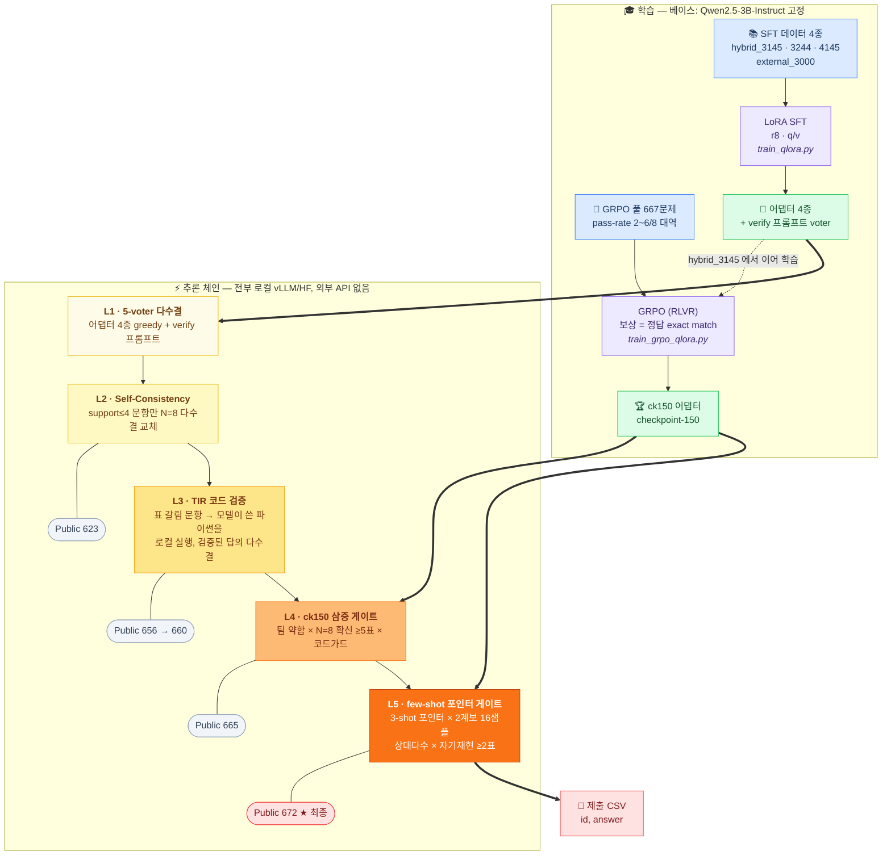

# 아주 소중한 딥러닝 챌린지 2026

Qwen2.5-3B-Instruct 단일 베이스 규정에서 LoRA 어댑터 앙상블 + test-time 파이프라인으로
Public 리더보드 **0.80866 (672/831)** 를 기록한 제출물입니다.

최종 제출 CSV(최종 테스트 2,000문제)는 주최측에 직접 전달하며 저장소에는 두지 않습니다.
대신 `reproduce_all.sh compose` 가 저장소에 보존된 추론 산출물에서 리더보드 제출본
전 단계를 **바이트 단위(sha256)로 재현·검증**합니다 (아래 [재현](#재현)).

## 파이프라인



- **L1**: 데이터를 달리해 학습한 어댑터 4종의 greedy + hybrid_3145 에 자기검증
  프롬프트를 얹은 5번째 voter 의 다수결.
- **L2**: 5-voter 합의가 약한(support≤4) 문항만 hybrid_3145 stochastic N=8 다수결로 교체.
- **L3**: 표가 갈리는 문항은 TIR — 모델이 쓴 파이썬을 로컬 서브프로세스로 실행해
  검증된 답의 다수결로 교체.
- **L4**: support≤4 문항에서 GRPO ck150 의 N=8 유일최빈이 5표 이상 확신하고
  코드 실행 결과가 반대하지 않으면 교체.
- **L5**: few-shot(3-shot) greedy 가 현행 답과 다른 문항을 포인터로 삼아,
  독립 2계보 16샘플 풀(ck150 N=8 + hybrid_3145 N=8)의 상대다수와
  few-shot stochastic N=8 자기재현(≥2표)이 모두 지지할 때만 교체.

추론은 전부 로컬(vLLM/HF)이고 외부 API·검색은 쓰지 않았습니다. test 문제는 학습에
사용하지 않았습니다.

## 재현

```bash
# 조립 검증: 보관된 추론 산출물 -> 제출본 6단계 재생성, 고정 sha256 과 바이트 대조 (GPU 불필요, ~1분)
bash scripts/reproduce_all.sh compose

# 전체 재생성: 생성부터 다시 (GPU, ~2시간. 샘플링이 확률적이라 바이트 일치는 안 됨)
bash scripts/reproduce_all.sh full
```

compose 는 체인 4종(623 포함) → 656 → 660 → 665 → 664 → **672(최종)** 를 전부
831행 sha256 일치로 검증합니다.

### 최종 테스트(2,000문제) 추론

```bash
# 1) vLLM 서버 (어댑터 등록 포함)
bash scripts/vllm_server.sh &
# 2) 전 층 재료 생성 (voter 5종 → SC N=8 → TIR → ck/fs 게이트 재료)
MEGA_IN=data/deep_chal_math_dataset_test.csv MEGA_OUT=outputs/final SKIP_N64=1 \
  bash scripts/mega_holdout_run.sh
# 3) 제출 CSV 조립 (answer 열이 채워진 입력이면 채점도 함께 수행)
python3 scripts/compose_final_submissions.py \
  --input data/deep_chal_math_dataset_test.csv --materials outputs/final \
  --emit c672=submissions/final_c672.csv
```

### 학습 재현

```bash
# SFT (voter 4종 공통, 예: hybrid_3145)
python3 scripts/train_qlora.py --data data/processed/hybrid_3145.jsonl \
  --learning-rate 2e-6 --lora-rank 8 --epochs 1 --seed 2026

# GRPO (ck150): hybrid_3145 에서 이어 학습, 곡선 정점 checkpoint-150 채택
python3 scripts/train_grpo_qlora.py --data data/processed/grpo_passrate_scaleup.jsonl \
  --adapter-path checkpoints/hybrid_3145_r8_qv_lr2e6_e1/final_adapter \
  --output-dir checkpoints/grpo_3145_scaleup_r8_qv_lr2e6_steps800_g8 \
  --max-steps 800 --learning-rate 2e-6 --batch-size 8 --gradient-accumulation 2 \
  --num-generations 8 --max-completion-length 512 --beta 0.005 \
  --save-steps 50 --seed 20260917
```

주요 랜덤 시드: SFT `2026`, GRPO `20260917`, 게이트용 N=8 풀 `20260924`,
few-shot N=8 `20260925`. 학습 로그는 `logs/grpo_scaleup_train.log`
(GRPO 전 구간, wandb 미사용).

## 체크포인트

| 어댑터 | 데이터 | LR | seed |
|---|---|---|---|
| hybrid_3145_r8_qv_lr2e6_e1 | hybrid_3145.jsonl (3,145) | 2e-6 | 2026 |
| hybrid_3244_r8_qv_lr2e6_e1 | hybrid_3244.jsonl (3,244) | 2e-6 | 2026 |
| external_3000_r8_qv_lr2e6_e1 | external_math_3000.jsonl (3,000) | 2e-6 | 2026 |
| hybrid_4145_r8_qv_lr1p5e6_e1 | hybrid_4145.jsonl (4,145)* | 1.5e-6 | 2026 |
| grpo_.../checkpoint-150 | grpo_passrate_scaleup.jsonl (667) | 2e-6 | 20260917 |

하이퍼파라미터·데이터 sha256 전체는 각 디렉터리의 `training_metadata.json` 참고.
verify voter 는 별도 가중치가 아니라 hybrid_3145 + 검증 프롬프트입니다.

\* hybrid_4145.jsonl 은 실험 정리 중 삭제됨. sha256 은 metadata 에 있고, 구성은
hybrid_3145.jsonl + NuminaMath-1.5 결정적 샘플링 1,000문제 (생성 스크립트 포함).

## 사용 데이터

각 파일의 정확한 구성·sha256·오염 제거 기록은 `data/**/*.manifest.json` 에 기계 판독
가능한 형태로 보존돼 있습니다.

### 대회 공식 데이터

| 파일 | 용도 |
|---|---|
| `data/deep_chal_math_dataset_train.csv` (17,000문제) | SFT 소재 선별, GRPO 학습 풀, 홀드아웃 검증셋 |
| `data/deep_chal_math_dataset_test.csv` (2,000문제) | **학습에 사용하지 않음** (최종 추론 대상만) |
| `data/deep_chal_math_leaderboard_filtered.csv` (831문제) | 리더보드 추론 대상 (compose 재현이 참조) |

### 외부 공개 데이터 (전부 무료·공개, 라이선스 명시)

| 데이터셋 | 리비전 | 라이선스 | 사용처 |
|---|---|---|---|
| [AI-MO/NuminaMath-1.5](https://huggingface.co/datasets/AI-MO/NuminaMath-1.5) | `1b05109f` | Apache-2.0 | external_3000 (일부), hybrid_3145 내 300, hybrid_4145 추가분 1,000 |
| [openai/gsm8k](https://huggingface.co/datasets/openai/gsm8k) | `740312a` | MIT | external_3000 (1,000) |
| [DigitalLearningGmbH/MATH-lighteval](https://huggingface.co/datasets/DigitalLearningGmbH/MATH-lighteval) | `92ace7ed` | MIT | external_3000 (1,200), hybrid_3145 내 700 |

선별은 전부 결정적(sha256 기반 고정 시드 샘플링, `scripts/prepare_hard_math_sft.py`)이며,
공식 train 17,000 + 리더보드 831 문제와의 중복은 정규화 exact match + token-Jaccard /
SequenceMatcher 근사 중복 검사로 제거했습니다 (manifest 의 `official_decontamination` 항목).

### 상용 API 생성 CoT (학습 데이터 구축 목적 — 규정상 허용)

`hybrid_3145.jsonl` 의 풀이(CoT) 중 2,145개는 상용 API 로 생성했습니다.
**학습 데이터 구축에만 사용**했으며, test 문제를 상용 API 에 입력하거나 추론 시점에
외부 모델을 호출한 사실은 없습니다.

| teacher | 샘플 수 |
|---|---|
| gpt-5.6-luna | 1,906 |
| gpt-5.4-mini-2026-03-17 | 133 |
| gpt-5.6-luna-high | 82 |
| gpt-5.6-terra | 19 |
| gpt-5.4-mini-high | 5 |

나머지는 사람이 쓴 공개 풀이(MATH-lighteval 700, NuminaMath 큐레이션 300)입니다.
문항 원문은 공식 train 및 위 공개 데이터셋에서만 가져왔습니다.

### GRPO (RLVR)

`data/processed/grpo_passrate_scaleup.jsonl` — 공식 train 에서 hybrid_3145 의
stochastic pass-rate 2~6/8 대역 667문제를 선별. 보상은 **공식 정답 라벨과의 exact match**
만 사용 (타 모델의 채점·판정 개입 없음).

### 기타

- TIR(코드 실행)은 데이터가 아니라 추론 기법이며, 실행은 전부 로컬 파이썬
  서브프로세스입니다. sympy(BSD) 등 표준 공개 라이브러리만 사용합니다.
- 실험 후 기각되어 최종 제출 경로에 포함되지 않는 데이터(NuminaMath-TIR 증류,
  DeepSeek-R1 공개 CoT, Qwen2.5-32B 증류 등)는 저장소에 없습니다.

## 환경

torch 버전 충돌 때문에 환경이 둘로 나뉩니다.

- `requirements.txt` — 학습/평가/조립 (torch 2.8, transformers 4.57)
- `requirements-vllm.txt` — vLLM 추론 서버용 별도 venv (torch 2.13)

베이스 모델은 `/workspace/models/Qwen2.5-3B-Instruct` 경로에 두면 됩니다
(Hugging Face `Qwen/Qwen2.5-3B-Instruct`, 저장소 미포함).
스크립트가 `/workspace/DLC` 절대 경로를 쓰므로 이 위치에 클론하는 걸 권장합니다.
확인된 GPU: RTX 5090 32GB, A100 80GB, RTX PRO 6000 Blackwell 96GB.

## 구성

```
checkpoints/   LoRA 어댑터 5종 + training_metadata.json  (최종 모델 체크포인트)
data/          공식 train/test CSV + 학습 데이터 + manifest (출처/sha256/오염 제거 기록)
outputs/       compose 재현용 추론 산출물 (voter/SC/TIR/게이트 재료)
scripts/       학습·추론·조립 스크립트
logs/          GRPO 학습 로그
REPORT.md      실험 보고서
```
