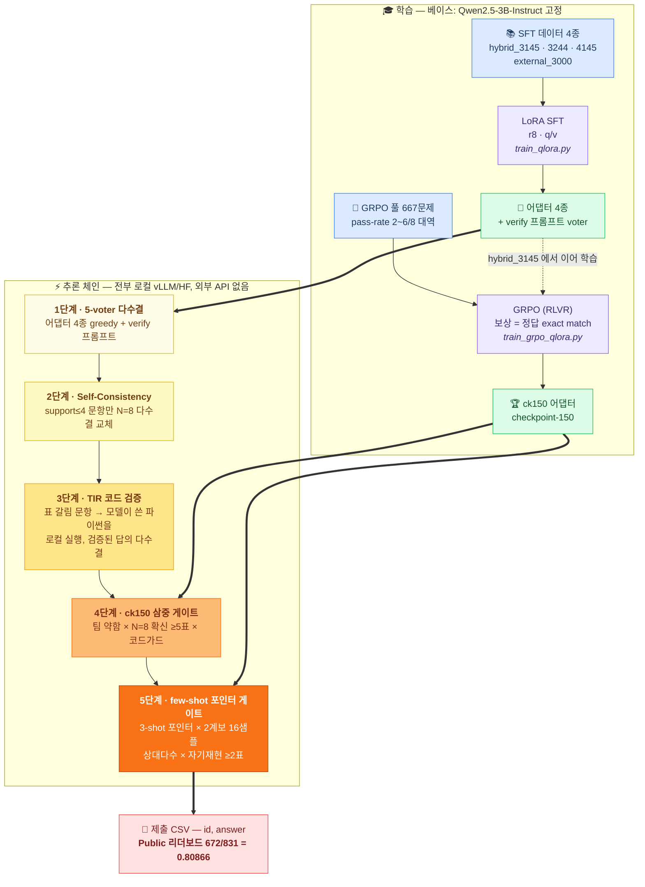

# 아주 소중한 딥러닝 챌린지 2026


3B 단일 베이스 규정에서 출발해, 데이터를 달리 학습한 LoRA 어댑터들을 추론 시점에
조합하는 방식으로 Public 리더보드 **672/831 (0.80866)** 을 기록했습니다.

핵심 아이디어는 간단합니다. 이 규모의 모델은 한 번의 greedy로는 틀리는 문제가 많지만,
정답이 여러 샘플 어딘가에는 들어 있는 경우가 훨씬 많습니다. 그래서 점수의 대부분은
학습이 아니라 **"어느 샘플의 답을 믿을지"를 고르는 추론 체인**에서 나왔습니다 —
다수결, self-consistency, 코드 실행 검증, 그리고 두 종류의 게이트를 5단계로 쌓았습니다.

이 저장소에는 최종 체크포인트, 학습·추론 전체 파이프라인, 사용 데이터와 재현 절차가
들어 있습니다. 최종 제출 CSV는 주최측에 직접 전달합니다.

## 파이프라인



각 단계가 하는 일:

| 단계 | 어떤 문항을 | 무엇으로 바꾸나 |
|---|---|---|
| 1 | 전체 | 어댑터 4종 greedy + 자기검증 프롬프트 voter, 5표 다수결 |
| 2 | 5-voter 합의가 약한 곳 (support≤4) | hybrid_3145 stochastic N=8 다수결 |
| 3 | 표가 갈리는 곳 | 모델이 쓴 파이썬을 로컬 실행, 출력이 검증된 답의 다수결 |
| 4 | support≤4 중 GRPO가 확신하는 곳 | ck150 N=8 유일최빈 ≥5표, 단 코드 실행 결과가 반대하면 취소 |
| 5 | few-shot greedy가 다른 답을 가리키는 곳 | 독립 2계보 16샘플 상대다수 + few-shot N=8 자기재현 ≥2표일 때만 교체 |

뒤 단계일수록 발동 조건이 좁고 근거를 여러 개 요구합니다. 넓게 바꾸는 규칙은
검증셋에서만 좋아 보이고 실제로는 배신하는 일이 많아서, 조건의 교집합이 성립할 때만
답을 바꾸도록 설계했습니다. test 문제는 어떤 형태로도 학습에 쓰지 않았습니다.

## 재현

### 최종 테스트 추론 (2,000문제)

```bash
# 1) vLLM 서버 (어댑터 등록 포함)
bash scripts/vllm_server.sh &

# 2) 재료 생성: voter 5종 → SC N=8 → TIR → 게이트 재료
MEGA_IN=data/deep_chal_math_dataset_test.csv MEGA_OUT=outputs/final SKIP_N64=1 \
  bash scripts/run_inference.sh

# 3) 제출 CSV 조립 (입력에 answer 열이 있으면 채점까지 해줌)
python3 scripts/compose_final_submissions.py \
  --input data/deep_chal_math_dataset_test.csv --materials outputs/final \
  --emit c672=submissions/final_c672.csv
```

### 학습

```bash
# SFT — voter 4종 공통 레시피, hybrid_3145 예시
python3 scripts/train_qlora.py --data data/processed/hybrid_3145.jsonl \
  --learning-rate 2e-6 --lora-rank 8 --epochs 1 --seed 2026

# GRPO — hybrid_3145 에서 이어 학습, 곡선 정점인 checkpoint-150 채택
python3 scripts/train_grpo_qlora.py --data data/processed/grpo_passrate_scaleup.jsonl \
  --adapter-path checkpoints/hybrid_3145_r8_qv_lr2e6_e1/final_adapter \
  --output-dir checkpoints/grpo_3145_scaleup_r8_qv_lr2e6_steps800_g8 \
  --max-steps 800 --learning-rate 2e-6 --batch-size 8 --gradient-accumulation 2 \
  --num-generations 8 --max-completion-length 512 --beta 0.005 \
  --save-steps 50 --seed 20260917
```

시드: SFT `2026` · GRPO `20260917` · 게이트용 N=8 풀 `20260924` · few-shot N=8 `20260925`.
GRPO 학습 로그는 `logs/grpo_scaleup_train.log` 에 전 구간이 남아 있습니다 (wandb 미사용).

### 조립 검증

```bash
bash scripts/reproduce_all.sh compose   # GPU 불필요, 1분이면 끝
```

생성 당시 샘플(`outputs/*.jsonl`)을 저장소에 보존해 뒀기 때문에, 답 선택 규칙(1~5단계)을
재실행해 제출본과 **바이트 단위(sha256)로 일치**하는지 검사할 수 있습니다.

`full` 모드는 샘플 생성부터 다시 돕니다. 다만 이 경로는 바이트 일치가 원리적으로
불가능합니다 — 같은 시드라도 GPU 기종이나 추론 엔진 버전이 다르면 부동소수점 연산
순서가 달라져, 확률이 비슷한 경계 토큰에서 다른 샘플이 나올 수 있습니다 (greedy 포함).
그래서 확률적인 생성과 결정적인 조립을 분리해, 조립 층만큼은 바이트 검증을 걸어 뒀습니다.

## 체크포인트

| 어댑터 | 학습 데이터 | LR | seed |
|---|---|---|---|
| hybrid_3145_r8_qv_lr2e6_e1 | hybrid_3145.jsonl (3,145) | 2e-6 | 2026 |
| hybrid_3244_r8_qv_lr2e6_e1 | hybrid_3244.jsonl (3,244) | 2e-6 | 2026 |
| external_3000_r8_qv_lr2e6_e1 | external_math_3000.jsonl (3,000) | 2e-6 | 2026 |
| hybrid_4145_r8_qv_lr1p5e6_e1 | hybrid_4145.jsonl (4,145) | 1.5e-6 | 2026 |
| grpo_.../checkpoint-150 | grpo_passrate_scaleup.jsonl (667) | 2e-6 | 20260917 |

전부 Qwen2.5-3B-Instruct 위의 LoRA(r8, q/v)입니다. 하이퍼파라미터와 데이터 sha256은
각 디렉터리의 `training_metadata.json` 에 있고, verify voter 는 별도 가중치가 아니라
hybrid_3145 에 자기검증 프롬프트를 얹은 것입니다.

## 사용 데이터

파일별 구성·sha256·오염 제거 기록은 `data/**/*.manifest.json` 에 기계 판독 가능한
형태로 남겨 뒀습니다.

**대회 공식 데이터**

| 파일 | 용도 |
|---|---|
| `deep_chal_math_dataset_train.csv` (17,000) | SFT 소재 선별, GRPO 풀, 홀드아웃 검증셋 |
| `deep_chal_math_dataset_test.csv` (2,000) | 최종 추론 대상 — **학습에 사용하지 않음** |
| `deep_chal_math_leaderboard_filtered.csv` | 조립 검증(compose)이 참조하는 문제 목록 |

**외부 공개 데이터** — 전부 무료·공개이고, 선별은 sha256 기반 고정 시드 샘플링으로
결정적입니다(`scripts/prepare_hard_math_sft.py`). 공식 train·평가 문제와의 중복은
정규화 exact match + token-Jaccard / SequenceMatcher 근사 검사로 걸렀습니다
(manifest 의 `official_decontamination`).

| 데이터셋 | 리비전 | 라이선스 | 사용처 |
|---|---|---|---|
| [AI-MO/NuminaMath-1.5](https://huggingface.co/datasets/AI-MO/NuminaMath-1.5) | `1b05109f` | Apache-2.0 | external_3000 일부, hybrid_3145 내 300, hybrid_4145 추가분 1,000 |
| [openai/gsm8k](https://huggingface.co/datasets/openai/gsm8k) | `740312a` | MIT | external_3000 (1,000) |
| [DigitalLearningGmbH/MATH-lighteval](https://huggingface.co/datasets/DigitalLearningGmbH/MATH-lighteval) | `92ace7ed` | MIT | external_3000 (1,200), hybrid_3145 내 700 |

**상용 API 생성 CoT** — `hybrid_3145.jsonl` 풀이 중 2,145개는 상용 API로 생성했습니다.
학습 데이터 구축에만 썼고, test 문제를 외부 API에 넣거나 추론 시점에 외부 모델을
호출한 일은 없습니다. 나머지 풀이는 사람이 쓴 공개 풀이(MATH-lighteval 700,
NuminaMath 큐레이션 300)이고, 문항 원문은 공식 train과 위 공개 데이터셋에서만 왔습니다.

| teacher | 샘플 수 |
|---|---|
| gpt-5.6-luna | 1,906 |
| gpt-5.4-mini-2026-03-17 | 133 |
| gpt-5.6-luna-high | 82 |
| gpt-5.6-terra | 19 |
| gpt-5.4-mini-high | 5 |

**GRPO 풀** — 공식 train에서 hybrid_3145 의 stochastic pass-rate 가 2~6/8인 667문제를
선별했습니다(`grpo_passrate_scaleup.jsonl`). 보상은 공식 정답 라벨과의 exact match 뿐이고,
다른 모델의 채점이나 판정은 개입하지 않습니다.

**기타** — TIR(코드 실행)은 데이터가 아니라 추론 기법입니다. 실행은 전부 로컬 파이썬
서브프로세스이고 sympy(BSD) 등 표준 공개 라이브러리만 씁니다.

## 환경

torch 버전 충돌 때문에 환경이 둘입니다:

- `requirements.txt` — 학습·평가·조립 (torch 2.8, transformers 4.57)
- `requirements-vllm.txt` — vLLM 추론 서버 전용 venv (torch 2.13)

베이스 모델(HF `Qwen/Qwen2.5-3B-Instruct`, 저장소 미포함)은
`/workspace/models/Qwen2.5-3B-Instruct` 에 두면 됩니다. 스크립트가 `/workspace/DLC`
절대 경로를 쓰므로 이 위치에 클론하는 걸 권장합니다.
동작 확인한 GPU: RTX 5090 32GB, A100 80GB, RTX PRO 6000 Blackwell 96GB.

## 저장소 구성

```
checkpoints/   LoRA 어댑터 5종 + training_metadata.json  (최종 모델 체크포인트)
data/          공식 train/test CSV + 학습 데이터 + manifest
outputs/       조립 검증용 추론 산출물 (voter/SC/TIR/게이트 재료)
scripts/       학습·추론·조립 스크립트
logs/          GRPO 학습 로그
REPORT.md      실험 보고서
```

### 스크립트 지도

직접 실행하는 진입점은 6개이고, 나머지는 전부 이들이 내부에서 호출하거나 import 합니다.

| 순서 | 진입점 | 하는 일 | 내부에서 쓰는 것 |
|---|---|---|---|
| 0 | `bootstrap_pod.sh` | 새 pod 의존성 복구 | — |
| 1 | `prepare_hard_math_sft.py` → `merge_sft_jsonl.py` | SFT 데이터 선별·병합 | — |
| 2 | `train_qlora.py` | LoRA SFT (어댑터 4종) | — |
| 3 | `screen_grpo_passrate.py` → `build_grpo_passrate_pool.py` | GRPO 풀 선별 | submit_baseline |
| 4 | `train_grpo_qlora.py` | GRPO 학습 (ck150) | — |
| 5 | `vllm_server.sh` + `run_inference.sh` | 추론 재료 전 층 생성 | gen_client · gen_fewshot_client · gen_n8_logprobs · tir_repair_client · mega_bands · screen_grpo_passrate |
| 6 | `compose_final_submissions.py` | 재료 → 제출 CSV 조립 (+answer 있으면 채점) | extractor_v2 · tir_common |
| — | `reproduce_all.sh` | 제출본 조립 재현 검증 (compose/full) | baseline · rebuild_chain · build_* 5종 · build_sc_source · extend_self_consistency_samples |

공용 모듈: `extractor_v2.py`(답 추출) · `tir_common.py`(코드 실행·정규화) ·
`submit_baseline.py`(프롬프트 정의) · `ensemble_predictions.py`(정수 정규화)
